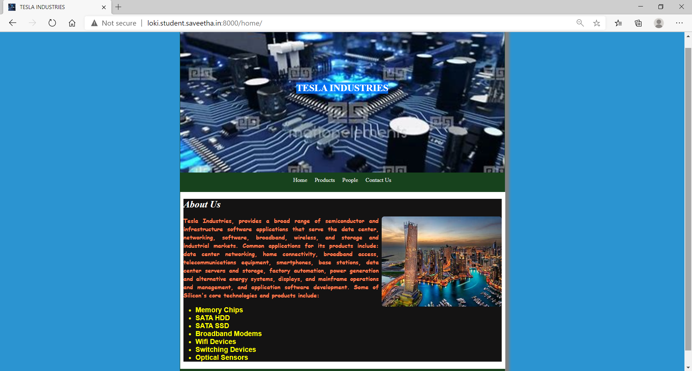
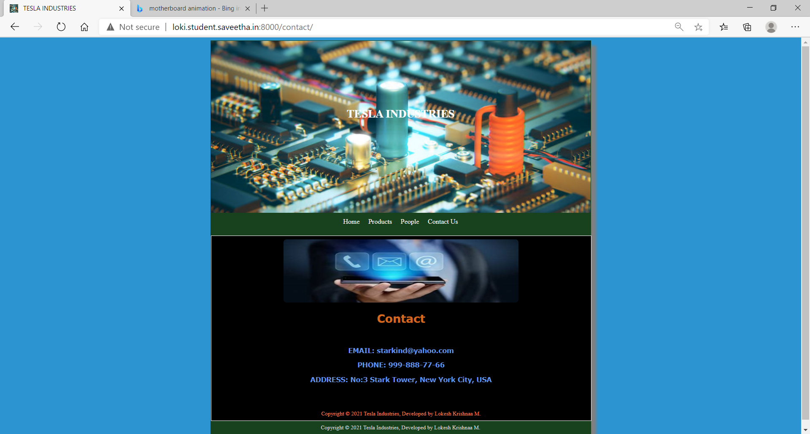
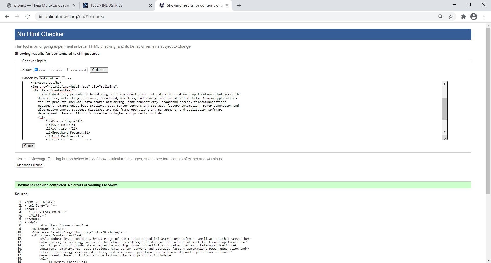

# Dynamic Website Design for a Manufacturing Company
## AIM:
To design a dynamic website for a chip manufacturing company.

## DESIGN STEPS:
### Step 1: 
Requirement collection.
### Step 2:
Creating the layout using HTML and CSS.
### Step 3:
Updating the sample content.
### Step 4:
Choose the appropriate style and color scheme.
### Step 5:
Validate the layout in various browsers.
### Step 6:
Validate the HTML code.
### Step 7:
Create a database model and migrate the database.
### Step 8:
Retrieve data from database and display it in a dynamic webpage.
### Step 9:
Publish the website in the given URL.

## PROGRAM:
### base.html
```

<!DOCTYPE html>
<html lang="en">

<head>
    <title>TESLA INDUSTRIES</title>
    <link rel="stylesheet" href="">
    <link rel="icon" href="" type="image/x-icon">

</head>

<body>
    <div class="container">
        <div class="banner">
            TESLA INDUSTRIES
        </div>
        <div class="menu">
            <div class="menuitem"><a href="/home">Home</a></div>
            <div class="menuitem"><a href="/products">Products</a></div>
            <div class="menuitem"><a href="/people">People</a></div>
            <div class="menuitem"><a href="/contact">Contact Us</a></div>
        </div>
        <div class="content">
            
            
        </div>
        <div class="footer">
            Copyright © 2021 Tesla Industries, Developed by Lokesh Krishnaa M.
        </div>
    </div>
</body>

</html>
```

### home.html
```





<div class="homecontent">
    <h1>About Us</h1>
    
    <div class="contenttext">
        Tesla Industries, provides a broad range of semiconductor and infrastructure software applications that serve the
        data center, networking, software, broadband, wireless, and storage and industrial markets. Common applications
        for its products include: data center networking, home connectivity, broadband access, telecommunications
        equipment, smartphones, base stations, data center servers and storage, factory automation, power generation and
        alternative energy systems, displays, and mainframe operations and management, and application software
        development. Some of Silicon's core technologies and products include:
        <ul>
            <li>Memory Chips</li>
            <li>SATA HDD</li>
            <li>SATA SSD </li>
            <li>Broadband Modems</li>
            <li>Wifi Devices</li>
            <li>Switching Devices</li>
            <li>Optical Sensors</li>
        </ul>
    </div>
</div>

```
### products.html
```



    <div class="productcontent">    
    <h1 style="text-align: center;"> Our Premium Products</h1>
    <div class="productitems">
        <div class="productitem"> 
            <div class="itemimage">
            
            </div>
            <div class="itemname">4GB DDRA4 laptop memory</div>
            <div class="itemprice">Price: Rs.2000.00 </div>
        </div>
        <div class="productitem"> 
            <div class="itemimage">
            
            </div>
            <div class="itemname">1TB Laptop HDD</div>
            <div class="itemprice">Price: Rs.5000.00 </div>
        </div>
        <div class="productitem"> 
            <div class="itemimage">
            
            </div>
            <div class="itemname">1TB Hard Disk</div>
            <div class="itemprice">Price: Rs.25000.00 </div>
        </div> <br> <br> <br> <br> <hr>
        <div class="productitem"> 
            <div class="itemimage">
            
            </div>
            <div class="itemname">Intel SSD</div>
            <div class="itemprice">Price: Rs.12000.00 </div>
        </div>
        <div class="productitem"> 
            <div class="itemimage">
            
            </div>
            <div class="itemname">Intel i3 Processor</div>
            <div class="itemprice">Price: Rs.1900.00 </div>
        </div>
        <div class="productitem"> 
            <div class="itemimage">
            
            </div>
            <div class="itemname">Bluetooth Adapter</div>
            <div class="itemprice">Price: Rs.1300.00 </div>
        </div> <br> <br> <br> <br> <hr>
        <div class="productitem"> 
            <div class="itemimage">
            
            </div>
            <div class="itemname">Apple ibeats</div>
            <div class="itemprice">Price: Rs.2100.00 </div>
        </div>
        <div class="productitem"> 
            <div class="itemimage">
            
            </div>
            <div class="itemname">Modem </div>
            <div class="itemprice">Price: Rs.3400.00 </div>
        </div>
        <div class="productitem"> 
            <div class="itemimage">
            
            </div>
            <div class="itemname">Apple Airpods</div>
            <div class="itemprice">Price: Rs.1400.00 </div>
        </div> <br> <br> <br> <br> <hr>
        <div class="productitem"> 
            <div class="itemimage">
            
            </div>
            <div class="itemname">Wireless Mouse</div>
            <div class="itemprice">Price: Rs.700.00 </div>
        </div>
        <div class="productitem"> 
            <div class="itemimage">
            
            </div>
            <div class="itemname">Pendriver</div>
            <div class="itemprice">Price: Rs.900.00 </div>
        </div>
        <div class="productitem"> 
            <div class="itemimage">
            
            </div>
            <div class="itemname">Logitech Speaker</div>
            <div class="itemprice">Price: Rs.1300.00 </div>
        </div>
        
    </div>
    </div>

         
```
### people.html
```


    <div class="id">
        <div>
            <div class="img">
            <h2>FOUNDER AND CHAIRMAN</h2>
            
            </div>  
            <h3><u>CHRIS HEMSWORTH</u></h3> <br> <br><br>
        </div>
        <div>
            <div class="img">
            <h2>CHIEF EXECUTIVE OFFICER</h2>
            
        </div>            
            <h3><u>ROBERT DOWNEY JUNIOR</u></h3> <br> <br> <br>
        </div>

        <div>
            <div class="img">
            <h2>DIRECTOR OF ENGINEERING</h2>
            
        </div>
            <h3><u>TOM CRUISE</u></h3> <br> <br> <br>
        </div>
        <div>
            <div class="img">
            <h2>SOFTWARE ANALYST AND CONSULTANT</h2>
            
        </div>            
            <h3><u>SHINSUKE NAKAMURA</u></h3> <br> <br> <br>
        </div>
        
        <div>
            <div class="img">
            <h2>CHIEF FINANCIAL OFFICER</h2>
            
        </div>           
            <h3><u>CHRIS EVANS</u></h3> <br><br><br>
        </div>
        <div>
            <div class="img">
            <h2>MANAGING DIRECTOR</h2>
            
        </div>          
            <h3><u>DWAYNE JOHNSON</u></h3> <br><br><br>
        </div>

    </div>

```
### contact.html
```




<div class="class1">
    <div>
        
    </div>
    <div>
        <h1>
            <centre>Contact</centre>
        </h1> <br>
        <h3><strong>EMAIL:</strong> starkind@yahoo.com</h3>
        <h3><strong>PHONE:</strong> 999-888-77-66</h3>
        <h3><strong>ADDRESS</strong>: No:3 Stark Tower, New York City, USA</h3>
        <br> <br> <br>
    </div>

    <footer id="s1">Copyright &COPY; 2021 Tesla Industries, Developed by Lokesh Krishnaa M.</footer>
</div>



```

## OUTPUT: 





## CODE VALIDATION REPORT:



## RESULT:
Thus a website is designed for the chip manufacturing company and is hosted in the URL http://loki.student.saveetha.in:8000/home HTML code is validated.